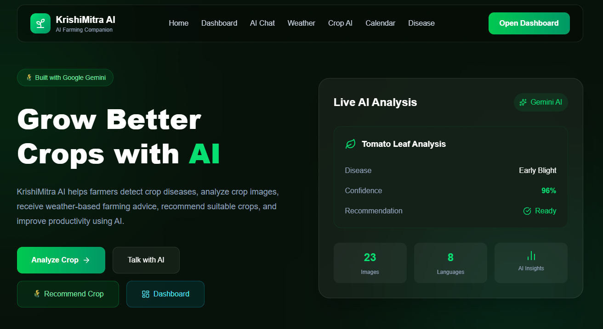
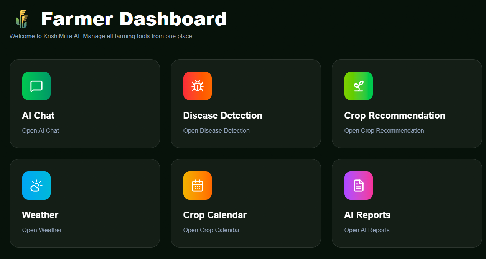
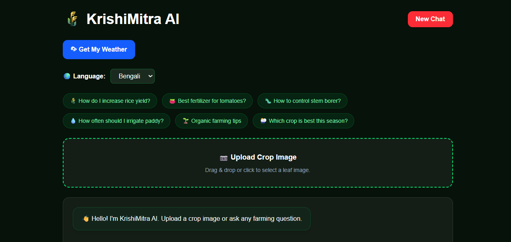
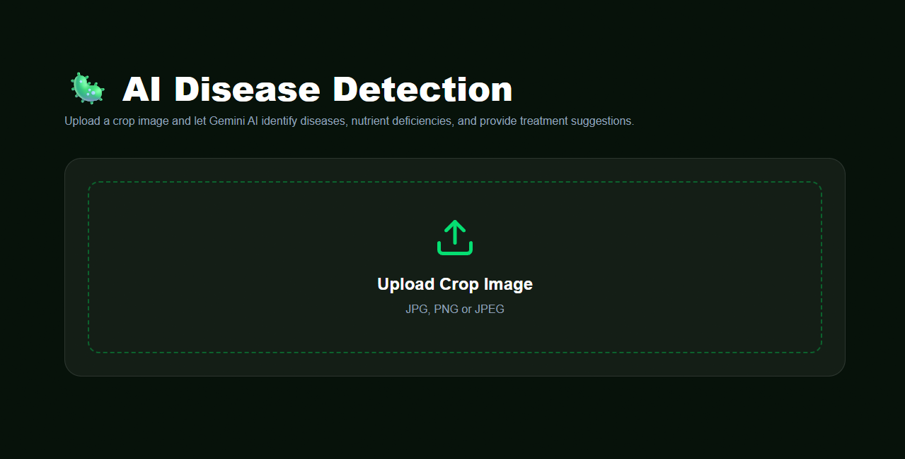
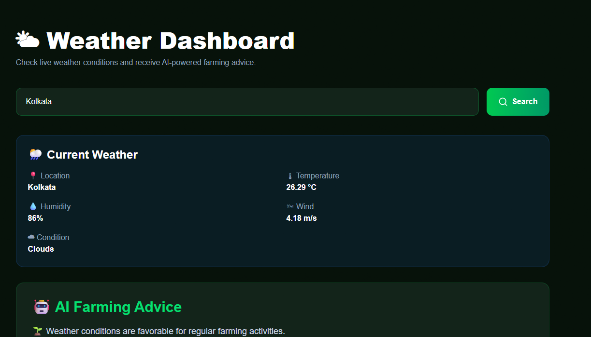
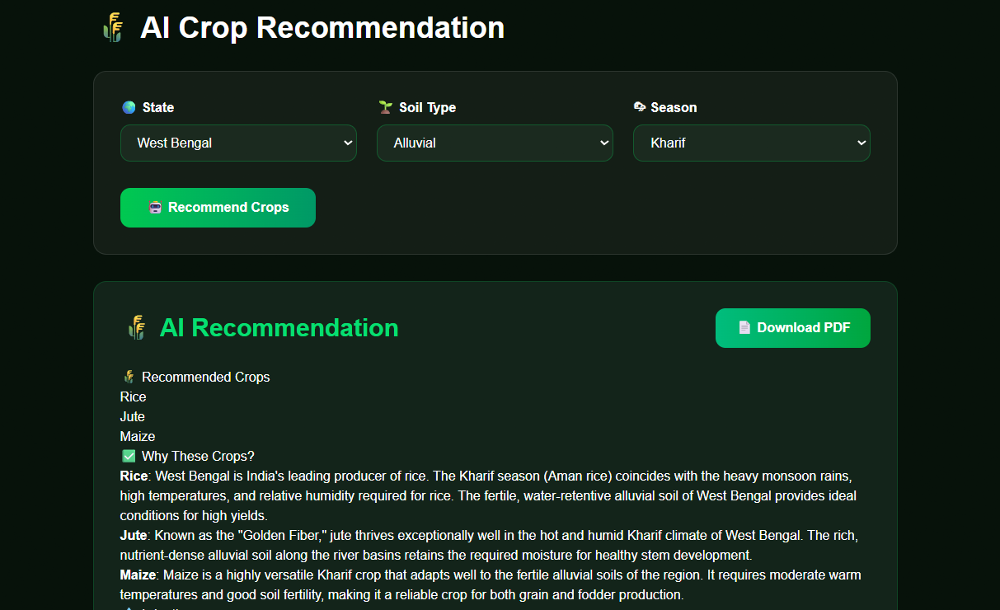
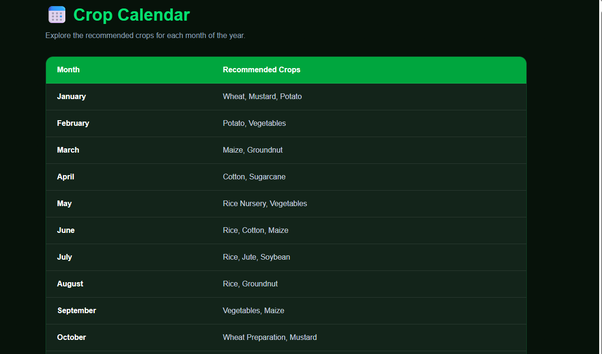

# 🌾 KrishiMitra AI

> **AI-Powered Smart Farming Assistant built with Google Gemini AI**

KrishiMitra AI is an intelligent agricultural assistant designed to help farmers make better decisions using Artificial Intelligence. The platform provides AI-powered crop disease detection, smart crop recommendations, weather insights, crop calendar guidance, multilingual support, and voice-enabled interaction.

---

## 🚀 Live Demo

🔗 **Frontend:** https://krishimitra-ai-three.vercel.app/

---

## ✨ Features

- 🌾 AI Crop Disease Detection using Google Gemini Vision
- 🤖 AI Farming Chat Assistant
- 🌦 Live Weather Dashboard with Farming Advice
- 🌱 Smart Crop Recommendation System
- 📅 Crop Calendar
- 🎤 Voice Input Support
- 🌍 Multilingual Support (English, Hindi, Bengali)
- 📄 Export AI Diagnosis as PDF
- 📋 Copy AI Response
- 📱 Fully Responsive UI
- ⚡ Built using React + Vite

---

# 📸 Screenshots

## 🏠 Home



---

## 📊 Dashboard



---

## 🤖 AI Chat



---

## 🦠 Disease Detection



---

## 🌤 Weather Dashboard



---

## 🌱 Crop Recommendation



---

## 📅 Crop Calendar



---

# 🛠 Tech Stack

### Frontend

- React 19
- Vite
- Tailwind CSS
- React Router
- Axios
- Framer Motion
- Lucide React

### AI

- Google Gemini 3.6 Flash
- Google GenAI SDK

### APIs

- OpenWeatherMap API
- Browser Speech Recognition API

### Libraries

- React Markdown
- jsPDF
- Browser Image Compression

---

# 📂 Project Structure

```text
krishimitra-ai/
│
├── frontend/
│   ├── public/
│   ├── src/
│   │   ├── components/
│   │   ├── pages/
│   │   ├── services/
│   │   ├── assets/
│   │   └── App.jsx
│   │
│   ├── package.json
│   └── vite.config.js
│
├── screenshots/
│
├── LICENSE
└── README.md
```

---

# ⚙ Installation

Clone the repository

```bash
git clone https://github.com/YOUR_USERNAME/krishimitra-ai.git
```

Go to the project

```bash
cd krishimitra-ai/frontend
```

Install dependencies

```bash
npm install
```

Create a `.env` file

```env
VITE_GEMINI_API_KEY=YOUR_GEMINI_API_KEY
VITE_OPENWEATHER_API_KEY=YOUR_OPENWEATHER_API_KEY
```

Start development server

```bash
npm run dev
```

Build

```bash
npm run build
```

---

# 🌍 AI Capabilities

### Crop Disease Detection

Upload a crop image to receive

- Disease Identification
- Confidence Level
- Symptoms
- Treatment Suggestions
- Organic Solutions
- Prevention Tips

---

### AI Chat

Ask questions like

- Which fertilizer should I use?
- How to prevent leaf blight?
- Best crop for West Bengal?
- Organic farming techniques

---

### Weather Intelligence

Provides

- Live Temperature
- Humidity
- Wind Speed
- Weather Conditions
- AI Farming Advice

---

### Crop Recommendation

Recommends suitable crops based on

- State
- Season
- Soil Type

---

### Crop Calendar

View seasonal crop planning guidance.

---

# 🔒 Disclaimer

KrishiMitra AI provides AI-generated agricultural recommendations for educational and informational purposes only.

For severe crop diseases or important farming decisions, users should consult their nearest **Krishi Vigyan Kendra (KVK)** or certified Agriculture Officer.

---

# 👨‍💻 Developer

**Souvik Pal**

- 💼 LinkedIn: https://www.linkedin.com/in/souvik-pal-182453388
- 📧 Email: souvikpal.dev@gmail.com

---

# 🙏 Acknowledgements

- Google Gemini AI
- OpenWeatherMap API
- React
- Vite
- Tailwind CSS
- Lucide Icons

---

# 📄 License

This project is licensed under the MIT License.

See the LICENSE file for details.

---

⭐ If you like this project, consider giving it a star on GitHub!